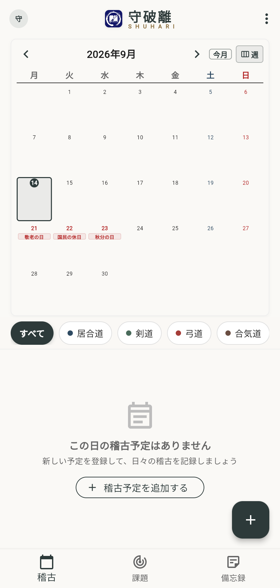
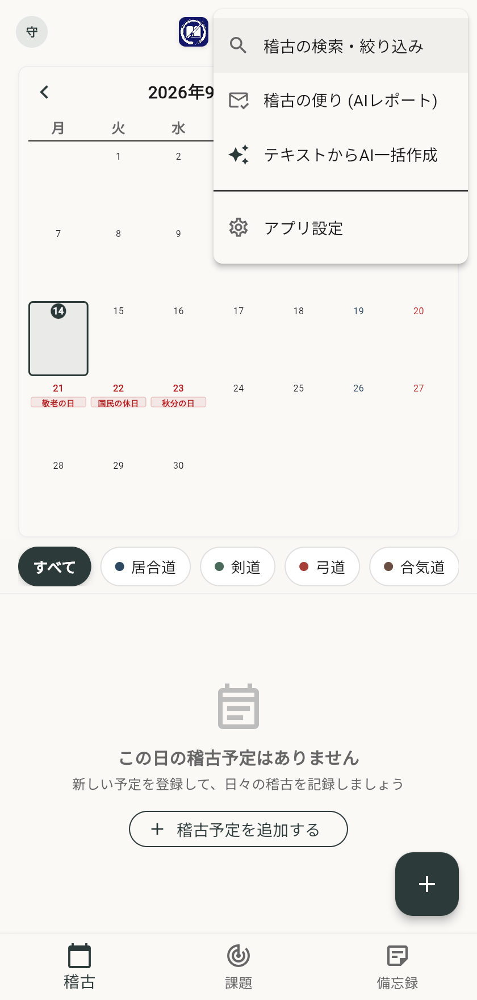
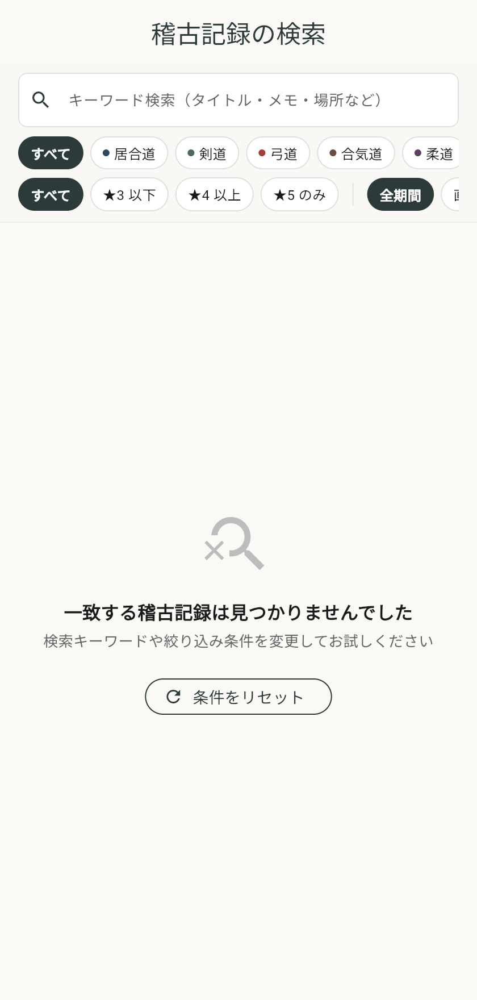
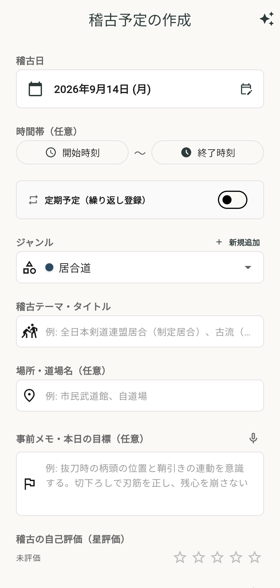
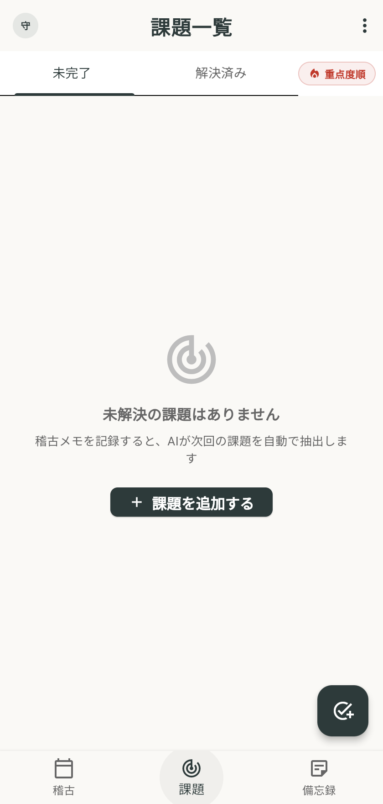
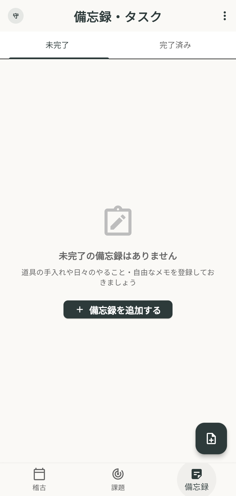
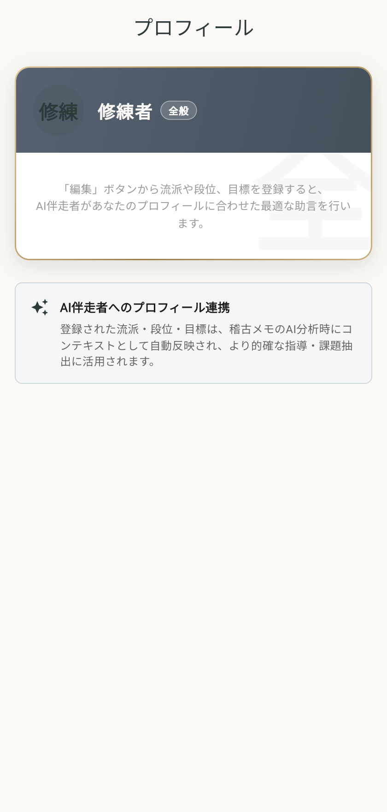
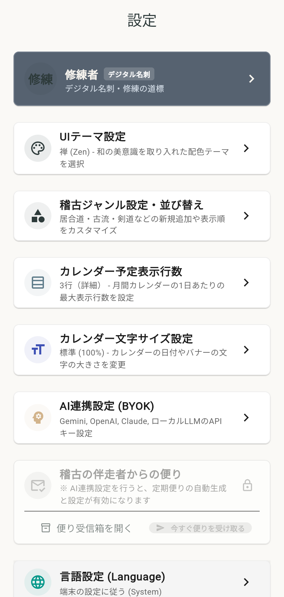
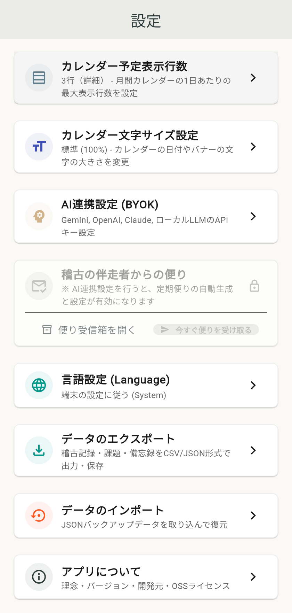

# 守破離 (Shuhari) ユーザー操作マニュアル

本書は、武道・芸道の修練を日々の記録とAIと共に深めるアプリ「守破離（Shuhari）」の操作手順を網羅した詳細ユーザーマニュアルです。

---

## 目次
1. [アプリ概要・コンセプト](#1-アプリ概要コンセプト)
2. [画面構成・共通ナビゲーション](#2-画面構成共通ナビゲーション)
3. [ホーム画面（稽古カレンダー）の使い方](#3-ホーム画面稽古カレンダーの使い方)
4. [便利なAppBarメニュー機能（右上 ⋮）](#4-便利なappbarメニュー機能右上-)
   - 4.1 [稽古の検索・絞り込み](#41-稽古の検索絞り込み)
   - 4.2 [稽古の便り（AI定期レポート）](#42-稽古の便りai定期レポート)
   - 4.3 [テキストからAI一括作成（LINE・連絡網流し込み）](#43-テキストからai一括作成line連絡網流し込み)
5. [稽古予定・実績の登録手順](#5-稽古予定実績の登録手順)
6. [稽古詳細・AI分析・共有](#6-稽古詳細ai分析共有)
7. [課題リストの管理](#7-課題リストの管理)
8. [備忘録（メモ）の管理](#8-備忘録メモの管理)
9. [設定画面（カスタマイズ・プロフィール・データ管理）](#9-設定画面カスタマイズプロフィールデータ管理)
   - 9.1 [プロフィール管理（デジタル名刺）](#91-プロフィール管理デジタル名刺)
   - 9.2 [基本設定・AI連携設定（BYOK）](#92-基本設定ai連携設定byok)
   - 9.3 [データ管理（エクスポート・復元・バックアップ）](#93-データ管理エクスポート復元バックアップ)
10. [よくある質問・トラブルシューティング](#10-よくある質問トラブルシューティング)

---

## 1. アプリ概要・コンセプト

「守破離（Shuhari）」は、日本の武道・芸道における修練の三段階「守・破・離」の精神に基づき、日々の稽古予定・実績・指導内容・気づきを克明に記録し、AIの力によって客観的な振り返りと課題抽出を支援するアプリケーションです。

- **ローカルファースト（スタンドアロン）**: アカウント登録やログインなしで、起動後すぐに使い始めることができます。データは端末内の安全なローカル領域（Web版はブラウザのIndexedDB）に保存されます。
- **BYOK（Bring Your Own Key）対応**: Gemini、OpenAI、Claude、あるいは自前ローカルLLM（Ollama等）のAPIキーをご自身で設定し、プライベートかつ自由なAI分析が可能です。
- **禅・和風の洗練されたUI**: 稽古の集中を妨げない、墨色と静寂を基調としたデザイン。

---

## 2. 画面構成・共通ナビゲーション

アプリ画面下部には、いつでも主要機能へ切り替えられる**ボトムナビゲーションバー**が配置されています。  
また、ホーム画面の右上には各種機能を集約した**メニューボタン（`⋮`）**が用意されています。

### ナビゲーション一覧

| ナビゲーション項目 | アイコン | 主な機能 |
| :--- | :--- | :--- |
| **稽古（ホーム）** | カレンダー | 月間カレンダーで稽古予定・実績を確認・選択 |
| **課題** | チェックリスト | AIが抽出した課題や手動登録した課題の進捗管理 |
| **備忘録** | ノート | 日常のメモや覚え書き、次回稽古に向けたToDo管理 |
| **メニュー（右上 `⋮`）** | 縦三点（`⋮`） | 稽古検索、稽古の便り（AIレポート）、AI一括作成、アプリ設定（⚙️） |

---

## 3. ホーム画面（稽古カレンダー）の使い方

ホーム画面は、月間の稽古スケジュールと該当日の一覧を確認する中心画面です。

### 3.1 カレンダーの操作
- **年月ナビゲーション**: 画面上部の左右矢印（`＜` / `＞`）をタップすると、前月・翌月へ切り替わります。
- **「今日」ボタン**: 他の月を表示していても、ワンタップで今月の今日の日付へ戻ることができます。
- **月／週 切り替え**: 右上の「月 / 週」ボタンで月間表示と週間表示を瞬時に切り替え可能です。
- **日付セル**: 各日付をタップすると、その日に登録されている稽古カードが画面下部に展開されます。
  - **稽古バッジ**: 予定が登録されている日付には、流派・ジャンルのカラーラベルが表示されます。
  - **表示行数**: 設定画面でカレンダー内のタイトル表示行数を「2行」「3行」「4行」から自由に切り替え可能です。
- **新規登録（＋ボタン）**: 画面右下の浮遊アクションボタン（FAB）をタップすると、稽古予定・実績の作成画面へ進みます。

---

## 4. 便利なAppBarメニュー機能（右上 ⋮）

ホーム画面右上の縦三点リーダー（`⋮`）をタップすると、日々の稽古や振り返りを強力にサポートするメニューが開きます。

### 4.1 稽古の検索・絞り込み
過去の稽古記録やこれからの予定を条件に応じて素早く検索できます。

- **フリーワード検索**: タイトル、メモ、道場・稽古場所名などのキーワードで検索。
- **流派・ジャンル絞り込み**: 「居合道」「剣道」など特定の流派のみを抽出。
- **星評価フィルター**: ★4以上、★5のみなど、会心の稽古や反省点を絞り込み。
- **期間指定**: 全期間、直近1ヶ月、今年など期間を指定して抽出。

### 4.2 稽古の便り（AI定期レポート）
月末や週末に、蓄積された稽古記録や課題の克服状況をAIが多角的に分析し、「稽古の伴走者からの手紙」として届けてくれる機能です。

- **総評と励まし**: 師範や伴走者のような温かい語り口で日々の精進を振り返り。
- **成長の手応え（星評価推移グラフ）**: 稽古の自己評価の推移がグラフで可視化されます。
- **未読通知**: 新しい便りが届くと、右上メニューに赤丸バッジでお知らせします。

### 4.3 テキストからAI一括作成（LINE・連絡網流し込み）
道場の連絡網やLINEグループ、メール等に届いた稽古日程のテキストをそのまま貼り付けるだけで、AIが日程・時間・場所・ジャンルを自動抽出してカレンダーへ一括登録します。

- **重複予定の自動除外**: 既にカレンダーに登録されている予定と日時が重複する場合、自動で検知して二重登録を防ぎます。
- **終日予定への自動対応**: 時間が明記されていない予定も「終日予定」としてスマートに登録されます。

---

## 5. 稽古予定・実績の登録手順

画面右下の「＋」ボタンをタップすると、登録画面が表示されます。

### 5.1 入力項目
1. **日付と時間帯**:
   - カレンダーから日付を選択します。
   - 稽古の開始時刻・終了時刻を設定します（時間未設定の場合は終日予定になります）。
2. **定期予定（繰り返し登録）**:
   - スイッチをONにすると、毎週決まった曜日の定期稽古を一括して複数週登録できます。
3. **ジャンル・流派タグ**:
   - 登録済みの流派・ジャンル（居合道、剣道、弓道、合気道など）を選択します。右上の「新規追加」から新しい流派も追加可能です。
4. **稽古テーマ・タイトル**:
   - 例: 「基本稽古・形稽古」「全日本剣道連盟居合」「指導対局」など。
5. **場所・道場名**:
   - 例: 「市民武道館」「白虎会道場」「自宅」など。
6. **事前メモ・本日の目標**:
   - 稽古に向かう前に意識したいテーマ（例：「抜刀時の柄頭の位置と鞘引きの連動を意識する」など）を記録しておけます。
7. **稽古の自己評価（★1〜5）**:
   - ※日付が「当日」または「過去」の場合に展開されます。タップで★1〜5段階の星評価を直感的に記録できます。
8. **稽古メモ（実績・指導内容）**:
   - ※当日・過去日の場合に展開されます。指導者から受けたアドバイス、手応え、反省点などを自由に入力します。
   - **音声入力対応**: マイクアイコンをタップすると、音声入力により稽古直後でも素早く記録できます。

### 5.2 保存
画面右上のチェックボタン（または下部の保存ボタン）を押すと、即座にローカルに保存されます。

---

## 6. 稽古詳細・AI分析・共有

カレンダー下部に表示される稽古カードをタップすると、稽古の詳細画面が表示されます。

### 6.1 AIによる自動分析
稽古メモを入力して保存すると、設定したAI（Gemini/OpenAI/Claude/ローカルLLM）がメモの内容を自動解析します：
- **稽古の要約**: 何を行い、何を感じたかを的確に整理。
- **助言・アドバイス**: 指導内容や反省点から、次回意識すべきポイントを提案。
- **課題の自動抽出**: 克服すべき弱点や継続練習項目が自動的に「課題リスト」へ連携・追加されます。

### 6.2 予定の変更・複製
- **日付の移動**: カレンダーアイコンをタップすると、実績メモや評価を保持したまま別日へ予定を移動できます。
- **予定の複製**: 右上メニューから「予定を複製」を選ぶと、基本情報（時間・場所・ジャンル）をコピーして翌週などの新しい予定を素早く作成できます。

### 6.3 AIによるSNS投稿文自動生成
右上メニュー（または画面下のボタン）から「SNS記事を作成」を選択すると、その日の稽古実績や自己評価をもとに、X（Twitter）やInstagram向けに魅力的なハッシュタグ付き投稿文をAIが自動作成します。OS標準の共有シートからワンタップで投稿できます。

---

## 7. 課題リストの管理

ボトムナビゲーションの「課題」タブを選択すると、修練における課題一覧が表示されます。

### 7.1 課題の確認と操作
- **未完了 / 解決済みの切り替え**: 画面上部のタブで、現在取り組んでいる課題と達成済みの課題を瞬時に切り替えられます。
- **重点度順ソート**: 右上の「重点度順」ボタンで、重要度の高い課題を優先表示できます。
- **スワイプ操作**:
  - **右スワイプ**: 課題を「解決済み」に移動します。
  - **左スワイプ**: 課題の削除、または未完了への差し戻し。
  - スワイプ直後は画面下に「元に戻す（Undo）」通知が表示されるため、誤操作時も安心です。

---

## 8. 備忘録（メモ）の管理

ボトムナビゲーションの「備忘録」タブを選択すると、日々のToDoや覚え書きを管理できます。

### 8.1 備忘録の使い方
- **簡易メモの登録**: 「防具の手入れ」「次回までに形の手順を確認」など、思いついた時に素早くメモを残せます。
- **期日設定**: 期日を設定しておくことで、稽古日までに完了すべき準備を整理できます。
- **完了チェック**: チェックボックスをタップするだけで、完了状態へ切り替えられます。

---

## 9. 設定画面（カスタマイズ・プロフィール・データ管理）

ホーム画面右上の**メニューボタン（`⋮`）＞「アプリ設定」**をタップすると、アプリ全体の設定画面が開きます。

### 9.1 プロフィール管理（デジタル名刺）
設定画面の最上部にある「修練者（デジタル名刺）」をタップすると、ご自身のプロフィール画面が開きます。

- **流派・段位・所属の登録**: 居合道、剣道などの各流派ごとに段位や道場名、今年の目標を登録可能。
- **AI伴走者へのコンテキスト連携**: 登録されたプロフィール情報は、日々の稽古メモをAIが分析する際にも参照され、あなたの現在のレベルや目標に応じた最適な助言が生成されます。

### 9.2 基本設定・AI連携設定（BYOK）
設定画面上部では、アプリの見た目やAIの動作環境を設定します。

1. **UIテーマ設定**:
   - 「禅（Zen・和紙調）」「漆（Urushi・ダークモード）」「モダン（Modern・クリーン）」の3つのデザインテーマから好みの色調を選択可能です。
2. **稽古ジャンル設定・並び替え**:
   - 居合道、剣道などの新規追加や、カレンダー・選択欄での表示順序を自由に並び替えできます。
3. **カレンダー予定表示行数・文字サイズ**:
   - 1日あたりのタイトル表示行数を「2行 / 3行 / 4行」から調整できます。文字サイズも変更可能です。
4. **AI連携設定（BYOK）**:
   - **プロバイダ選択**: Google Gemini、OpenAI、Anthropic Claude、ローカルLLM（Ollama等）から選択。
   - **APIキー入力**: 暗号化された安全な領域に保存されます。
   - **接続テスト**: ボタンを押すだけで、APIキーが正しく動作しているかその場で確認できます。

### 9.3 データ管理（エクスポート・復元・バックアップ）
設定画面を下部にスクロールすると、大切なデータのバックアップと復元に関する設定項目が用意されています。

1. **言語設定 (Language)**:
   - システム自動 / 日本語 / 英語 を切り替えられます。
2. **データのエクスポート**:
   - **CSV形式**: スプレッドシートやExcelで一覧分析できる形式で書き出します。
   - **JSON形式（完全バックアップ）**: すべての稽古記録・課題・メモ・ジャンルを完全な状態でバックアップファイルとして保存します。
3. **データのインポート（復元）**:
   - 保存したJSONバックアップファイルを読み込むことで、機種変更やブラウザ移行時にも瞬時に全データを安全に復元できます。
4. **アプリについて (About)**:
   - バージョン情報、理念、オープンソースライセンス一覧を確認できます。

---

## 10. よくある質問・トラブルシューティング

### Q1. アプリを閉じたりブラウザを更新（F5）したらデータは消えますか？
**A.** 消えません。データはお使いの端末・ブラウザ内部（IndexedDB）に自動永続化されます。ただし、ブラウザの「すべての履歴・サイトデータを削除」を実行すると消去される可能性があるため、定期的に設定画面から「JSONエクスポート」を行ってバックアップを保存することをお勧めします。

### Q2. インターネット接続がなくても動きますか？
**A.** 予定の閲覧・作成・メモ・課題管理など、AI分析以外のすべての機能はオフラインでも完全動作します。

### Q3. AI分析やAI一括登録が動作しません。
**A.** 画面右上のメニュー（`⋮`）＞「アプリ設定」を開き、「AI連携設定 (BYOK)」からAPIキーが正しく入力されているか確認し、「接続テスト」を行ってください。

### Q4. スマホのホーム画面からアプリのように全画面で起動したい（PWA機能）。
**A.** 
- **Android（Chrome）**: 画面右上のブラウザメニュー（︙）から「アプリをインストール」または「ホーム画面に追加」をタップします。
- **iOS（Safari）**: 画面下部の共有ボタンから「ホーム画面に追加」をタップします。
- これにより、ネイティブアプリ同様に全画面で快適に起動できるようになります。

---

&copy; 2026 Alirex Labs. All rights reserved.
